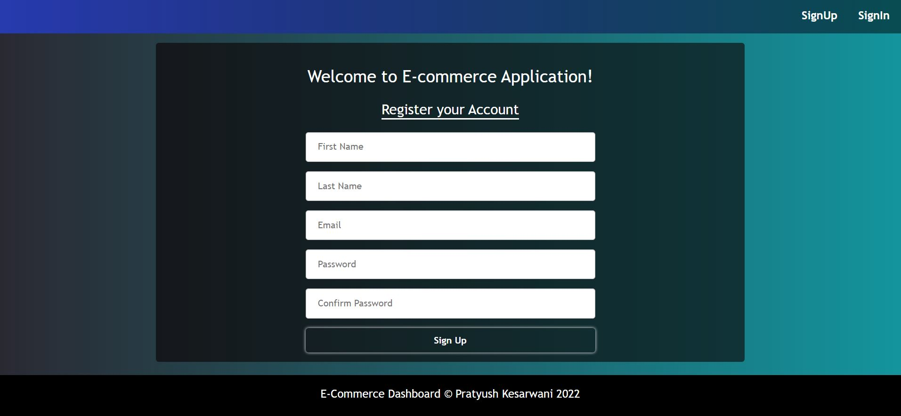

// Setup
1. Download Nodejs
2. Make package.json file
3. Install Express js and Mongodb package.
4. Install Nodemon
5. Make Index file and run it

We are creating database and collection from mongodb compass not using api because they are created only once.
Creating folders for database connection, model and controller. 
Testing whether data from postman is getting saved into database.

Then do frontend setup

// Fix cors issue in Node:
It feels like error is in frontend but it is not real, it is visible in browser not in postman.

//Complete Signup Flow:

1. Intergrating signup with api
2. save data in local storage
3. make private component: some routes/components which we don't want to expose. Like we don't want user to move into product page when he is not registerd. So, we can do this using private component. we can also with condition inside component but it may breaks.
In private component, if user is registered then we can't go to signup , he has access of all pages. if he has't signup then he cannot go to any page, he can only go to sign/ register page.
4. handle signup page and localstorage
5. update navbar with logout and sign up menu

// Logout tutorial
1. Make a function for logout.
2. Clear localstorage
3. Redirect user to signup
4. bug fix of last part

// Login Tutorial
1. Make route for api
2. pass data from postman
3. fetch result from db
4. remove password from register and login api
5. test flow

